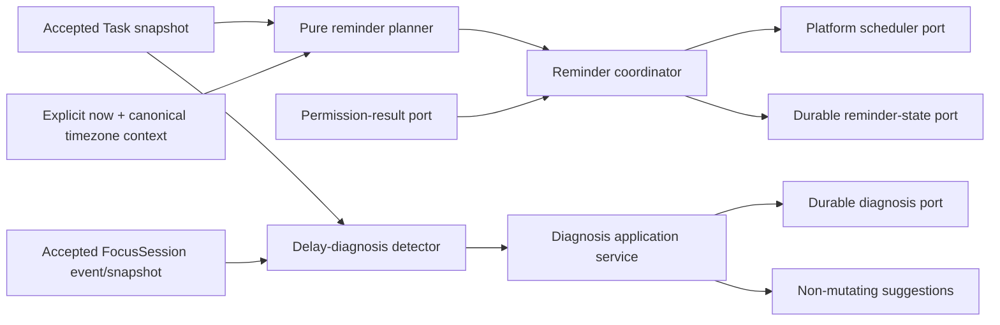

# GAP-P0-03A reminder scheduling and delay diagnosis design draft

> **NON-BINDING / INPUTS NOT VERIFIED**
>
> This file is an architecture and test-planning draft only. It is not a test
> specification, issue acceptance contract, lock asset, implementation mandate,
> or production-repair authority. No executable test, helper, manifest, self
> identity, red/green baseline, compiler result, or review result exists for
> GAP-P0-03A.

## 1. Why this draft is intentionally non-binding

The shared execution environment currently prevents the independent test author
from reading the project files through the pinned runtime, and the task expressly
forbids shell, Jest, and TypeScript execution while that limit is active. The
available non-shell resources do not expose workspace file contents. Therefore,
the author has not verified the PRD, GAP inventory, accepted A2 scheduling tests,
or the GAP-P0-02B FocusSession contract.

It would be unsafe to guess frozen method names, parameter shapes, return types,
status values, error codes, storage schemas, or manifest identities. This draft
uses only the facts supplied by the Manager:

- Task scheduling involves `scheduledStartAt`, `dueAt`, and `startedAt`;
- delay guidance may use `estimatedMinutes` and `firstStep`;
- the accepted FocusSession boundary has seven methods, whose exact signatures
  are not yet available here; and
- accepted A2 operation identity and lifecycle semantics must remain compatible.

Every other identifier below is descriptive. Names such as “planner”,
“coordinator”, “scheduler port”, and “diagnosis store” describe responsibilities,
not required public exports.

## 2. Inputs that must be verified before test authoring

The next test-author turn must read the authoritative versions, not summaries or
stale copies, of all items below.

1. Original/derived PRD passages for local reminders, overdue behavior,
   permissions, timezone meaning, delay diagnosis, privacy, and suggestions.
2. The current GAP list and the exact GAP-P0-03A issue wording, dependencies,
   exclusions, and delivery criteria.
3. Accepted A2 specification, manifest identity, public compiler contracts, and
   locked behavior tests for Task fields and lifecycle operations involving
   update, reschedule, delay, complete, cancel, and soft-delete/delete.
4. The exact A2 definitions of operation ID normalization, replay, conflict,
   concurrent duplicate calls, failed attempts, clock consumption, detached
   results, and stable error propagation.
5. Accepted or current GAP-P0-02B specification, manifest identity, seven public
   FocusSession methods, session states, interruption semantics, persistence,
   restart behavior, operation identity, and privacy boundary.
6. Existing repository/storage transaction and durable-backend contracts,
   especially whether reminder/diagnosis metadata may be additive and how it
   coordinates with task/focus state.
7. Current TypeScript/Jest configuration and established CompilerHost/runtime
   contract-test helpers.
8. Package and native constraints, including whether any notification adapter is
   already selected. No package or native change is authorized by this draft.

Questions that require an authoritative answer before freezing tests:

- Is timezone stored per task, per user/profile, or supplied as reconciliation
  context? What is its canonical representation?
- Is `scheduledStartAt` an absolute instant, a local wall-clock value, or both?
- What reminder offsets and overdue grace window does the PRD require?
- Does `dueAt` produce its own reminder independently of `scheduledStartAt`?
- Which Task states are terminal, and how is cancellation distinguished from
  deletion?
- Which lifecycle mutation owns atomic coordination with reminder state?
- What constitutes “repeated delay” and a Focus interruption for diagnosis?
- Are diagnosis reason values persisted wire values, localized labels, or both?
- What exact length/character rules apply to free text and suggestions?
- May one task/session have multiple diagnosis revisions, or exactly one record?

## 3. Proposed issue split, subject to verification

### GAP-P0-03A — platform-independent core

Proposed minimum scope:

- pure reminder-plan derivation from an accepted Task snapshot plus explicit
  time/timezone context;
- platform-neutral scheduling, cancellation, permission-query, persistence, and
  clock/timezone ports;
- a coordinator that maintains one current reminder generation per task,
  supports deterministic reconciliation, and exposes recoverable failure
  semantics without prescribing storage keys or write order;
- pure delay-diagnosis eligibility/reason validation;
- platform-neutral diagnosis persistence/query/summary behavior; and
- real public CompilerHost and runtime factory contracts after the exact
  existing API style is verified.

### GAP-P0-03B — native and lifecycle integration

Proposed deferred scope:

- React Native/iOS/Android notification-library adapters;
- OS permission prompts, channels/categories, background delivery, deep links,
  and device-specific limits;
- app lifecycle, system-clock, timezone-change, and OS notification callbacks;
- wiring to the exact frozen A2 lifecycle service and exact 02B FocusSession
  boundary; and
- device/integration tests and native configuration.

03A should consume the abstract tri-state permission result
`denied | notDetermined | granted` conceptually, but must not import a React
Native notification package. Whether those exact wire strings already exist is
an input-verification question, not a decision made here.

## 4. Conceptual architecture

The following diagram shows responsibility flow only; it does not lock module or
method names.

Suggested internal responsibility boundaries:

- **Reminder policy:** pure calculation only; no storage, platform call, timer,
  permission prompt, or global timezone lookup.
- **Reminder coordinator:** serializes per-task intent, compares desired versus
  durable generations, calls ports, compensates failures, and returns detached
  state.
- **Reconciler:** on app start or explicit environment change, re-derives desired
  plans from authoritative task state and removes stale platform schedules.
- **Diagnosis policy:** detects eligibility and validates a stable reason plus
  optional trimmed private text.
- **Diagnosis service:** associates one accepted diagnosis operation with the
  authoritative task/session identity and persists/query-copies it.
- **Summary projector:** aggregates stable reason/category counts only and never
  exposes private free text.

Factories should be side-effect free: construction must not request permission,
read storage, inspect system timezone, schedule/cancel notifications, register
listeners, start timers, or access network/device APIs. Initialization and
reconciliation must be explicit operations, using the verified project style.

## 5. Reminder invariants to turn into tests

These are desired behavioral properties; exact names, offsets, grace windows,
and error codes remain unverified.

1. **Canonical inputs:** plan calculation receives an explicit Task snapshot,
   explicit current instant, and explicit canonical timezone context. It never
   reads host-local time implicitly.
2. **Determinism:** equal canonical inputs yield equal ordered plans and stable
   logical identities.
3. **Source fields:** only verified scheduling fields influence reminder time;
   unrelated Task edits do not churn platform schedules.
4. **Policies:** early, on-time, and overdue strategies are distinguishable and
   ordered. The PRD decides their exact offsets and grace behavior.
5. **Exact deadline:** a due/start deadline that is still valid is preserved to
   the exact accepted instant; no rounding or locale-string conversion occurs.
6. **No overdue burst:** reconciliation never emits a backlog of expired local
   reminders. Past entries are skipped or collapsed according to the verified
   PRD rule.
7. **Latest generation:** at most one current generation exists per task.
   Superseded platform handles cannot remain authoritative.
8. **Cancellation/rebuild:** a current generation can be cancelled, and desired
   state can be rebuilt from durable task data after process restart.
9. **Permission result:** denied and not-determined states produce no platform
   schedule; granted may schedule. The core records/exposes the adapter result
   without opening permission UI itself.
10. **Lifecycle convergence:** schedule-affecting update/reschedule/delay replaces
    the current generation; completion/cancellation/deletion removes it. Reusing
    an accepted operation ID must follow frozen A2 replay/conflict semantics.
11. **Atomic observable outcome:** after success, task and reminder state agree.
    After a caught scheduler/storage failure, callers observe either the complete
    before-state or complete after-state, never an unowned hybrid.
12. **Restart reconciliation:** a new facade built only from durable serialized
    state can converge platform schedules without sharing Maps, promises, module
    coordinators, or object references from the old process.
13. **Environment changes:** forward/backward clock jumps, DST gaps/overlaps, and
    canonical timezone changes trigger deterministic re-evaluation without
    duplicate delivery.
14. **Cross-facade linearization:** two facades racing on one task converge to the
    latest committed task intent and one platform generation.
15. **Detached output:** caller mutation of returned plans/state cannot alter
    durable or coordinator state.

## 6. Conceptual lifecycle-to-reminder matrix

Exact lifecycle method names and status values must be replaced with the frozen
A2 definitions before tests are written.

| Conceptual task intent | Reminder effect | Required no-op/replay property |
|---|---|---|
| Update unrelated field | Keep current generation | No scheduler or storage churn |
| Update schedule field | Atomically replace or cancel plan | Same operation replay makes no new adapter call |
| Reschedule | Replace from canonical new start/due values | Conflicting reuse has zero reminder side effect |
| Delay | Replace; never stack another active generation | Repeated same operation does not compound delay |
| Complete | Cancel every active handle for task | Replay remains cancelled without extra call |
| Cancel | Cancel every active handle for task | Terminal gate prevents rebuild |
| Soft-delete/delete | Cancel every active handle for task | Deleted task is excluded during restart reconcile |

An implementation may choose schedule-first, storage-first, journaled, or another
recoverable protocol. Tests should lock only the observable before/after state,
exact port fault cause if consistent with accepted error conventions, compensation
completion, retryability, and convergence—not private key names or write order.

## 7. Permission and reconciliation matrix

| Input condition | Core expectation | Explicit non-expectation |
|---|---|---|
| `denied` | No platform schedule; desired plan remains explainable/queryable if PRD permits | No automatic permission prompt |
| `notDetermined` | No platform schedule; surface actionable state | No assumed grant or repeated prompt loop |
| `granted` | Reconcile exact future desired plan | No direct RN/native API import in core |
| App restart, unchanged task/timezone | Idempotent reconciliation; one generation | No shared process-local state |
| Restart after task change | Stale handles removed, latest desired plan installed | No replay of expired backlog |
| Forward clock jump | Expired entries skipped/collapsed per verified rule | No notification burst |
| Backward clock jump | Future plan recomputed once | No duplicate logical reminder |
| DST gap/overlap | Canonical instant and local intent follow verified timezone rule | No host-locale parsing |
| Timezone change | Rebuild only plans whose canonical meaning changes | No silent mutation of Task fields |

## 8. Delay-diagnosis model to verify

### Candidate detection inputs

- scheduled start has passed while the task has not started;
- verified repeated-delay history crosses the PRD threshold; or
- an accepted FocusSession associated with the task ends through a qualifying
  interruption.

These signals should produce an eligibility prompt/event, not an automatic
diagnosis record. Terminal or deleted tasks are ineligible. Exact meanings of
“not started”, “terminal”, “deleted”, “repeated”, and “interrupt” come from A2,
02B, and the PRD.

### Candidate stable reason categories

The requested human meanings are:

- estimate inaccurate;
- first step unclear;
- task too large;
- externally blocked; and
- other.

Their final persisted identifiers must be verified against the PRD and existing
naming conventions. This draft does not lock English/Chinese labels or wire
strings.

### Diagnosis invariants

1. A diagnosis references exactly one authoritative task and, when focus-derived,
   exactly one authoritative session.
2. Missing, cross-task, terminal, deleted, or incompatible session/task links
   fail without persistence.
3. Reason is one verified stable category; arbitrary category strings fail.
4. Optional private free text is normalized by the verified rule (at minimum,
   surrounding whitespace should be considered) and bounded before persistence.
   Exact empty/length/Unicode rules remain to verify.
5. Suggestions may propose a clearer `firstStep`, revised `estimatedMinutes`, or
   reschedule input, but never mutate Task or FocusSession automatically.
6. Accepted operation identity/replay semantics apply if diagnosis creation is a
   mutation under the established architecture.
7. Restarted facades rehydrate diagnoses from serialized durable data without
   process-local references.
8. Queries use a verified deterministic order with an explicit tie-breaker and
   return deeply detached records/suggestions.
9. Summary projection exposes counts/rates by stable non-sensitive dimensions;
   it never returns or embeds private free text.
10. Caller mutation of input, returned diagnosis, query arrays, nested suggestion,
    or summary cannot alter durable state.

## 9. Planned deterministic test harness

No harness is created in this draft. After input verification, the independent
test author should build only test-local, typed doubles:

- a manual clock returning explicit instants (not a real or fake timer);
- an explicit timezone-context source with canonical identifiers;
- an in-memory scheduler adapter recording ordered schedule/cancel attempts,
  commits, handles, and caller-provided fault objects;
- byte-serializable reminder/diagnosis storage reconstructed into a new Map for
  restart tests;
- counting/forbidden operation ID and clock providers where compatible with A2;
- controllable promise barriers for concurrency, with no sleep or timeout-based
  ordering; and
- immutable fixture builders for accepted Task and FocusSession shapes.

Tests must call real production factories/modules. They may use test adapters but
must not mock/replace production modules, access network/device/native APIs, use
real/fake timers, increase timeouts, suppress TypeScript, or escape through
`any`/`unknown` casts.

## 10. Proposed test matrix after inputs are verified

The IDs are planning labels, not test names or locked issue IDs.

### A. Public contract and factory

| ID | Scenario | Oracle | Tentative stage |
|---|---|---|---|
| API-01 | Compile a consumer of verified reminder/diagnosis ports and factories with a real TypeScript CompilerHost | Exact accepted public shapes compile; excess/missing members and native-library coupling fail | 03A |
| API-02 | Load real runtime modules and enumerate verified exports | Runtime namespace matches compiler contract; type-only symbols do not leak | 03A |
| API-03 | Construct factories with recording ports | Zero reads, writes, permission prompts, schedules, cancellations, timers, or listener registration | 03A |

### B. Reminder planning policy

| ID | Scenario | Oracle | Tentative stage |
|---|---|---|---|
| PLAN-01 | Future scheduled start and due date | Exact ordered early/on-time/deadline plan required by PRD | 03A |
| PLAN-02 | Missing start, missing due, and both missing | Only semantically available reminders; no invented instant | 03A |
| PLAN-03 | Deadline exactly at current instant and just before/after | Exact boundary with no rounding | 03A |
| PLAN-04 | Already-overdue set spanning many old instants | No catch-up burst; verified skip/collapse rule | 03A |
| PLAN-05 | Forward/backward clock jumps | Deterministic one-generation result | 03A |
| PLAN-06 | DST gap, DST overlap, and canonical timezone change | Verified canonical instant behavior, no duplicates | 03A |
| PLAN-07 | Caller mutates task/context/returned plan | Repeated derivation and stored state unchanged | 03A |

### C. Reminder coordination and faults

| ID | Scenario | Oracle | Tentative stage |
|---|---|---|---|
| REM-01 | Permission denied/not-determined/granted | Exact adapter-result mapping; schedules only when allowed | 03A core / 03B adapter |
| REM-02 | Same task receives schedule-affecting update/reschedule/delay | One latest generation; stale handles cancelled | 03A |
| REM-03 | Complete/cancel/delete | All active task handles cancelled; restart does not rebuild | 03A |
| REM-04 | Unrelated Task update | Zero scheduler and metadata mutation | 03A |
| REM-05 | Same operation replay and conflicting reuse | Frozen A2 semantics; zero duplicate schedule/cancel | 03A after A2 verification |
| REM-06 | Scheduler fails before/after observable effect | Stable accepted error/cause, compensation, exact before-state, retry | 03A |
| REM-07 | Reminder storage fails at each discovered mutation stage | Exact raw rollback or recoverable journal state, no orphan handle | 03A |
| REM-08 | Two facades race old/new schedule intent | Linearizable latest commit, one generation, no orphan handle | 03A |
| REM-09 | Byte-only process restart reconciliation | New facade converges without shared Map/promise/module state | 03A |
| REM-10 | Native scheduler and permission mapping | Device adapter satisfies the already-locked port contract | 03B |

### D. Delay diagnosis

| ID | Scenario | Oracle | Tentative stage |
|---|---|---|---|
| DIA-01 | Planned start passed but task not started | Eligible exactly at verified boundary | 03A |
| DIA-02 | Repeated delay below/at/above threshold | Deterministic threshold, no duplicate prompt/record | 03A |
| DIA-03 | Qualifying/non-qualifying Focus interruption | Uses only verified 02B boundary; exact task/session association | 03A after 02B verification |
| DIA-04 | Each stable reason plus invalid reason | Accepted categories persist; invalid input has zero write | 03A |
| DIA-05 | Free text whitespace, empty, Unicode, and length boundaries | Verified normalization/privacy rule; no raw leak in errors | 03A |
| DIA-06 | Mismatched/missing task or session, terminal/deleted task | Stable verified failure; zero write | 03A |
| DIA-07 | Suggest first step/estimate/reschedule | Detached suggestion only; Task/Focus durable bytes unchanged | 03A |
| DIA-08 | Same operation replay/conflict and concurrent submission | One task/session diagnosis according to verified cardinality | 03A |
| DIA-09 | Restart and ordered query with timestamp ties | Byte-only hydration, deterministic tie-breaker, deep isolation | 03A |
| DIA-10 | Summary over private diagnoses | Exact non-sensitive counts; no free-text value/key fragments | 03A |
| DIA-11 | Diagnosis storage failure | Exact rollback, retryability, no Task/Focus mutation | 03A |

## 11. Minimal executable-candidate recommendation

After authoritative inputs are available, do not convert every table row into a
separate test blindly. A minimal independent 03A candidate could target roughly
four suites and eighteen tests, using typed parameterized cases to cover the
matrix:

1. public CompilerHost/runtime/factory contract;
2. pure reminder policy and time boundaries;
3. reminder coordination/restart/atomic failure/concurrency; and
4. diagnosis validation/persistence/query/privacy.

This is a planning estimate, not inventory. Suite count, test count, expected
red/green split, and production target files remain unspecified until the
authoritative APIs are read. If 03A implementation scope would require modifying
the frozen A2 lifecycle surface or all native platforms at once, split the issue
before tests are locked rather than weakening or overfitting the tests.

## 12. Promotion checklist

This draft may become a formal test-first candidate only after all steps below:

1. Read and cite the authoritative PRD/GAP/A2/02B inputs and their accepted
   manifest identities.
2. Replace every descriptive API reference with verified public/private scope;
   do not introduce a new public surface unless the issue explicitly authorizes
   it.
3. Confirm the 03A/03B split with the Manager against actual implementation cost
   and dependency boundaries.
4. Have an independent unit-test author create the specification, typed helper,
   and executable tests without production edits.
5. Run real CompilerHost/runtime tests, record the honest red/green baseline,
   frozen regressions, TypeScript, static bypass scan, and manifest audit.
6. Create the content manifest last, record its self identity, and stop edits.
7. Dispatch a brand-new independent test reviewer. Only an accepted exact self
   may authorize a production repair agent.

Until then, this file remains **NON-BINDING / INPUTS NOT VERIFIED** and must not
be cited as a frozen product contract.
